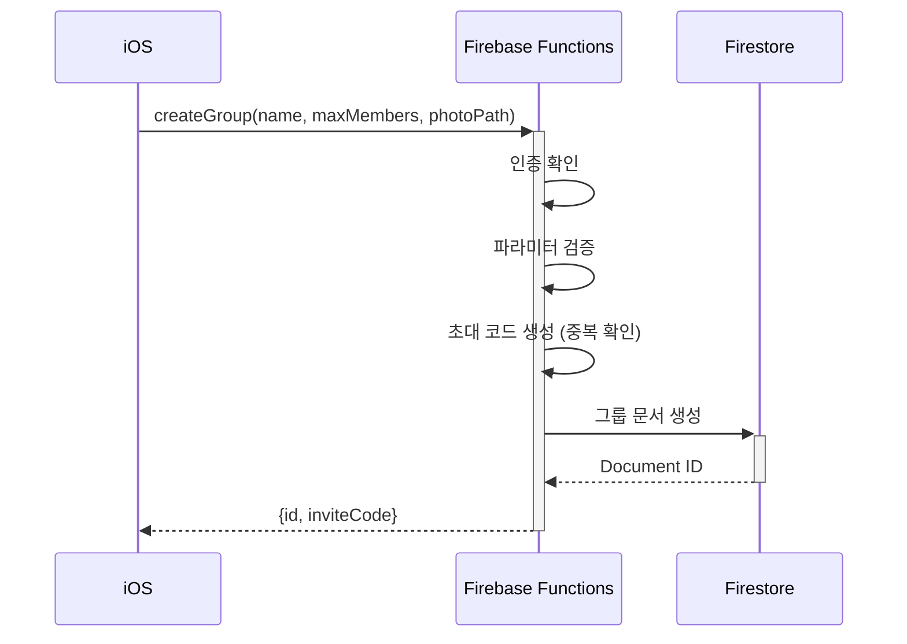

# Firebase Functions API 명세서

> iOS 앱과 Firebase Functions 간 통신 규격

**버전**: 1.0.0
**Region**: asia-northeast3 (서울)
**인증**: Firebase Authentication
**마지막 업데이트**: 2024-12-29

---

## 📋 목차

- [공통 사항](#공통-사항)
- [API 목록](#api-목록)
  - [createGroup](#creategroup) - 그룹 생성
  - [testCallable](#testcallable) - 테스트용
- [에러 코드](#에러-코드)
- [Firestore 스키마](#firestore-스키마)

---

## 🔧 공통 사항

### Endpoint Base
```
https://asia-northeast3-[PROJECT_ID].cloudfunctions.net
```

### 인증
모든 Callable Functions는 Firebase Auth 토큰을 자동으로 전달합니다.

```swift
// iOS에서는 자동으로 처리됨
functions.httpsCallable("functionName").call(data)
```

### 에러 처리
```swift
do {
  let result = try await functions.httpsCallable("createGroup").call(data)
} catch {
  // FirebaseFunctions.FunctionsError
  if let functionsError = error as NSError? {
    let code = functionsError.code  // FunctionsErrorCode
    let message = functionsError.localizedDescription
  }
}
```

---

## 📡 API 목록

### createGroup

**그룹 생성**

새로운 그룹을 생성하고 초대 코드를 발급합니다.

#### 기본 정보
- **함수명**: `createGroup`
- **타입**: Callable Function
- **인증**: 필수 ✅
- **Region**: asia-northeast3

#### Request

**Parameters**

| 필드 | 타입 | 필수 | 설명 | 제약 조건 |
|------|------|------|------|-----------|
| `name` | String | ✅ | 그룹 이름 | 최소 2글자 이상 |
| `maxMembers` | Int | ✅ | 최대 인원 | 2~10 사이 정수 |
| `photoPath` | String? | ❌ | 그룹 이미지 경로 | Storage 경로 |

**예시 (Swift)**
```swift
let data: [String: Any] = [
  "name": "주말 등산 모임",
  "maxMembers": 5,
  "photoPath": "groups/abc123/photo.jpg"  // optional
]

let result = try await functions
  .httpsCallable("createGroup")
  .call(data)
```

**예시 (cURL - 테스트)**
```bash
curl -X POST \
  https://asia-northeast3-[PROJECT_ID].cloudfunctions.net/createGroup \
  -H "Authorization: Bearer [FIREBASE_TOKEN]" \
  -H "Content-Type: application/json" \
  -d '{
    "data": {
      "name": "주말 등산 모임",
      "maxMembers": 5,
      "photoPath": "groups/abc123/photo.jpg"
    }
  }'
```

#### Response

**Success (200)**

| 필드 | 타입 | 설명 |
|------|------|------|
| `id` | String | 생성된 그룹 ID (Firestore Document ID) |
| `inviteCode` | String | 초대 코드 (6자리 영숫자, 예: `AB12CD`) |

```json
{
  "id": "xYz9Abc123Def456",
  "inviteCode": "AB12CD"
}
```

**예시 (Swift)**
```swift
guard let payload = result.data as? [String: Any],
      let id = payload["id"] as? String,
      let inviteCode = payload["inviteCode"] as? String else {
  throw CreateGroupError.invalidResponse
}

print("그룹 ID: \(id)")
print("초대 코드: \(inviteCode)")
```

#### Errors

| 코드 | HTTP | 설명 | 해결 방법 |
|------|------|------|-----------|
| `unauthenticated` | 401 | 로그인이 필요합니다 | Firebase Auth 로그인 확인 |
| `invalid-argument` | 400 | 잘못된 파라미터 | name, maxMembers 값 확인 |
| `internal` | 500 | 초대 코드 생성 실패 | 재시도 |

**에러 메시지 예시**
```json
{
  "error": {
    "code": "invalid-argument",
    "message": "그룹 이름은 최소 2글자 이상이어야 합니다"
  }
}
```

#### Side Effects

1. **Firestore**: `groups` 컬렉션에 새 문서 생성
2. **초대 코드**: 중복되지 않는 6자리 코드 자동 생성 (최대 5번 재시도)
3. **기본값 설정**:
   - `memberCount`: 1 (생성자)
   - `activePromiseCount`: 0
   - `requireApproval`: false
   - `defaultMinimumParticipants`: 2

#### 실행 흐름



---

### testCallable

**테스트용 Callable Function**

개발/디버깅 시 Firebase Functions 연결을 테스트합니다.

#### 기본 정보
- **함수명**: `testCallable`
- **타입**: Callable Function
- **인증**: 선택적 (없어도 동작)
- **Region**: asia-northeast3

#### Request

| 필드 | 타입 | 필수 | 설명 |
|------|------|------|------|
| `name` | String? | ❌ | 사용자 이름 (기본값: "Guest") |

```swift
let data: [String: Any] = ["name": "홍길동"]
let result = try await functions.httpsCallable("testCallable").call(data)
```

#### Response

| 필드 | 타입 | 설명 |
|------|------|------|
| `message` | String | 인사 메시지 |
| `authenticated` | Bool | 인증 여부 |
| `uid` | String? | 사용자 UID (인증된 경우) |

```json
{
  "message": "Hello 홍길동!",
  "authenticated": true,
  "uid": "abc123xyz"
}
```

---

## ⚠️ 에러 코드

### FunctionsErrorCode (iOS)

Firebase Functions의 에러는 iOS에서 `FunctionsErrorCode`로 매핑됩니다.

| Functions 코드 | iOS 코드 | HTTP | 설명 |
|----------------|----------|------|------|
| `unauthenticated` | `.unauthenticated` | 401 | 인증 실패 |
| `invalid-argument` | `.invalidArgument` | 400 | 잘못된 파라미터 |
| `permission-denied` | `.permissionDenied` | 403 | 권한 없음 |
| `not-found` | `.notFound` | 404 | 리소스 없음 |
| `already-exists` | `.alreadyExists` | 409 | 이미 존재 |
| `resource-exhausted` | `.resourceExhausted` | 429 | 요청 한도 초과 |
| `internal` | `.internal` | 500 | 내부 서버 오류 |
| `unavailable` | `.unavailable` | 503 | 서비스 불가 |
| `deadline-exceeded` | `.deadlineExceeded` | 504 | 타임아웃 |

### 에러 처리 예시 (Swift)

```swift
do {
  let result = try await functions.httpsCallable("createGroup").call(data)
  // 성공 처리
} catch {
  let nsError = error as NSError

  switch nsError.code {
  case FunctionsErrorCode.unauthenticated.rawValue:
    print("로그인이 필요합니다")

  case FunctionsErrorCode.invalidArgument.rawValue:
    print("입력값을 확인해주세요: \(nsError.localizedDescription)")

  case FunctionsErrorCode.internal.rawValue:
    print("서버 오류가 발생했습니다. 잠시 후 다시 시도해주세요.")

  default:
    print("알 수 없는 오류: \(error)")
  }
}
```

---

## 🗄️ Firestore 스키마

### groups 컬렉션

Firebase Functions가 생성하는 그룹 문서의 구조입니다.
**iOS의 `Group` 모델과 일치해야 합니다.**

#### Document 구조

| 필드 | 타입 | 필수 | 기본값 | 설명 |
|------|------|------|--------|------|
| `name` | String | ✅ | - | 그룹 이름 |
| `description` | String? | ❌ | null | 그룹 설명 (현재 미사용) |
| `emoji` | String? | ❌ | null | 그룹 이모지 (현재 미사용) |
| `themeColor` | String? | ❌ | null | 테마 색상 (현재 미사용) |
| `photoPath` | String? | ❌ | null | 그룹 이미지 Storage 경로 |
| `memberCount` | Int | ✅ | 1 | 현재 멤버 수 |
| `activePromiseCount` | Int | ✅ | 0 | 활성 약속 수 |
| `maxMembers` | Int | ✅ | - | 최대 인원 (2~10) |
| `requireApproval` | Bool | ✅ | false | 가입 승인 필요 여부 |
| `defaultMinimumParticipants` | Int | ✅ | 2 | 기본 최소 참여 인원 |
| `inviteCode` | String | ✅ | 생성됨 | 초대 코드 (6자리, 유니크) |
| `createdBy` | String | ✅ | auth.uid | 생성자 UID |
| `createdAt` | Timestamp | ✅ | 서버시각 | 생성 시각 |
| `updatedAt` | Timestamp | ✅ | 서버시각 | 수정 시각 |
| `isDeleted` | Bool | ✅ | false | 삭제 여부 (Soft Delete) |

#### 예시 (Firestore)

```json
{
  "name": "주말 등산 모임",
  "description": null,
  "emoji": null,
  "themeColor": null,
  "photoPath": "groups/abc123/photo.jpg",
  "memberCount": 1,
  "activePromiseCount": 0,
  "maxMembers": 5,
  "requireApproval": false,
  "defaultMinimumParticipants": 2,
  "inviteCode": "AB12CD",
  "createdBy": "user_uid_123",
  "createdAt": {"_seconds": 1703894400, "_nanoseconds": 0},
  "updatedAt": {"_seconds": 1703894400, "_nanoseconds": 0},
  "isDeleted": false
}
```

#### 인덱스

성능을 위해 다음 인덱스 생성 권장:

```javascript
// Firestore Indexes
groups
  - inviteCode (ascending)
  - createdBy (ascending)
  - isDeleted (ascending), createdAt (descending)
```

---

## 🔐 보안 규칙 고려사항

### Firestore Security Rules

```javascript
rules_version = '2';
service cloud.firestore {
  match /databases/{database}/documents {
    match /groups/{groupId} {
      // 읽기: 그룹 멤버만
      allow read: if isGroupMember(groupId);

      // 생성: Functions만 (클라이언트에서 직접 생성 금지)
      allow create: if false;

      // 수정: 그룹 멤버만
      allow update: if isGroupMember(groupId);

      // 삭제: 생성자만
      allow delete: if resource.data.createdBy == request.auth.uid;
    }
  }

  function isGroupMember(groupId) {
    return exists(/databases/$(database)/documents/groups/$(groupId)/members/$(request.auth.uid));
  }
}
```

---

## 📊 성능 및 제한사항

### Functions 설정

| 항목 | 값 | 설명 |
|------|-----|------|
| Max Instances | 10 | 동시 실행 최대 인스턴스 (비용 제어) |
| Memory | 256MB | 기본 메모리 할당 |
| Timeout | 60s | 기본 타임아웃 |
| Region | asia-northeast3 | 서울 리전 |

### 제한사항

- **초대 코드 생성**: 최대 5번 재시도 후 실패 시 에러 반환
- **Rate Limiting**: Firebase Functions 기본 제한 적용
- **최대 인원**: 2~10명 (하드코딩)
- **그룹 이름**: 최소 2글자

---

## 🧪 테스트

### 로컬 테스트 (Emulator)

```bash
cd infra/firebase/functions

# Functions Emulator 실행
npm run serve

# 테스트 호출
curl -X POST \
  http://localhost:5001/[PROJECT_ID]/asia-northeast3/testCallable \
  -H "Content-Type: application/json" \
  -d '{"data": {"name": "Test"}}'
```

### iOS에서 Emulator 연결

```swift
#if DEBUG
// AppDelegate 또는 초기화 시점
Functions.functions().useEmulator(withHost: "localhost", port: 5001)
#endif
```

---

## 📝 변경 이력

| 버전 | 날짜 | 변경 내용 |
|------|------|-----------|
| 1.0.0 | 2024-12-29 | 초기 버전 (createGroup, testCallable) |

---

## 🔗 관련 문서

- [Firebase Functions 문서](https://firebase.google.com/docs/functions)
- [iOS FirebaseFunctions SDK](https://firebase.google.com/docs/functions/callable)
- [프로젝트 아키텍처](.ai/PROJECT_CONTEXT.md)
- [개발 체크리스트](.ai/CHECKLIST.md)

---

**문서 유지보수**: Firebase Functions를 수정할 때마다 이 문서도 함께 업데이트하세요.
