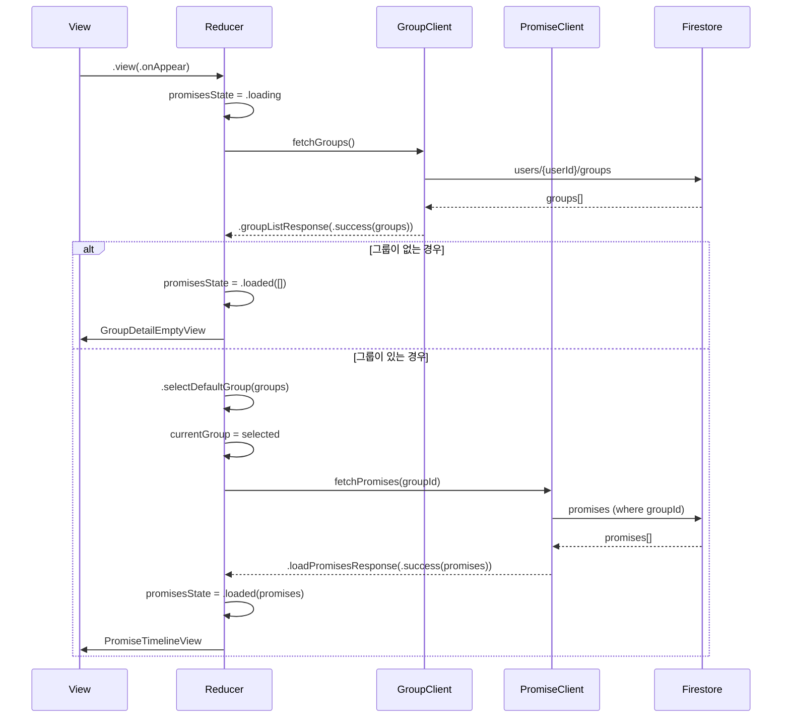

# Group Feature - State Flow

## 개요
그룹의 약속을 조회하고 관리하는 Group Feature의 화면 렌더링 플로우를 설명합니다.

---

## 목차
- [화면 로딩 플로우](#화면-로딩-플로우)
- [화면 렌더링 조건 분기](#화면-렌더링-조건-분기)
- [State 주요 필드](#state-주요-필드)
- [Computed Properties](#computed-properties)
- [에러 처리 플로우](#에러-처리-플로우)
- [사용자 액션 처리](#사용자-액션-처리)

---

## 화면 로딩 플로우

### 1단계: View.onAppear

```
View.onAppear
  ↓
promisesState = .idle
  ↓
.internal(.fetchGroupList) 전송
```

**설명:**
- 앱 화면이 나타날 때 그룹 리스트를 불러오는 작업을 시작합니다.

---

### 2단계: Internal.fetchGroupList

```
Internal.fetchGroupList
  ↓
promisesState = .loading
  ↓
Effect: groupClient.fetchGroups()
  ↓
  ├─ Success → .internal(.groupListResponse(.success(groups)))
  └─ Failure → .internal(.groupListResponse(.failure(error)))
```

**처리 내용:**
- State를 로딩 상태로 변경
- `groupClient.fetchGroups()`를 통해 사용자가 속한 그룹 리스트 조회
- 성공/실패 여부에 따라 적절한 액션 전송

---

### 3단계: Internal.groupListResponse
```
Internal.groupListResponse
  ↓
state.availableGroups = groups (저장)
  ↓
.internal(.selectDefaultGroup(groups)) 전송
```

**처리 내용:**
- 불러온 그룹 리스트를 `state.availableGroups`에 저장
- 기본 그룹 선택 로직으로 위임

---

### 4단계: Internal.selectDefaultGroup
```
Internal.selectDefaultGroup(groups)
  ↓
그룹 선택 우선순위:
  ├─ [1순위] currentUser.pinnedGroupId 매칭
  │    ↓
  │    state.currentGroup = pinnedGroup
  │
  ├─ [2순위] pinnedGroupId 없거나 매칭 실패
  │    ↓
  │    state.currentGroup = groups.first
  │
  └─ [3순위] groups가 비어있음
       ↓
       state.currentGroup = nil
  ↓
currentGroup == nil?
  ├─ YES: promisesState = .loaded([])
  │       화면: GroupDetailEmptyView
  │
  └─ NO: .internal(.fetchPromises(groupId)) 전송
```

**그룹 선택 로직:**
1. 사용자가 고정한 그룹 (`pinnedGroupId`) 우선
2. 고정 그룹이 없으면 첫 번째 그룹
3. 그룹이 비어있으면 `currentGroup = nil`

**빈 그룹 처리:**
- `currentGroup == nil`이면 빈 화면 표시
- 그룹 리스트가 비어있는 경우도 자연스럽게 처리됨

---

### 5단계: Internal.fetchPromises

```
Internal.fetchPromises(groupId)
  ↓
promisesState = .loading
  ↓
Effect: promiseClient.fetchPromises(groupId)
  ↓
  ├─ Success → .internal(.loadPromisesResponse(.success(promises)))
  └─ Failure → .internal(.loadPromisesResponse(.failure(error)))
```

**Firestore 쿼리:**
```swift
db.collection("promises")
  .whereField("groupId", isEqualTo: groupId)
  .whereField("status", isEqualTo: "active")
  .order(by: "startAt")
```

---

### 6단계: Internal.loadPromisesResponse

```
Internal.loadPromisesResponse
  ↓
  ├─ [Success]
  │    ↓
  │    promisesState = .loaded(promises)
  │    ↓
  │    화면: 정상 약속 리스트
  │      ├─ StatusFilterView
  │      └─ PromiseTimelineView
  │           ├─ 오늘
  │           ├─ 내일
  │           └─ 이후 약속
  │
  └─ [Failure]
       ↓
       promisesState = .failed(error)
       ↓
       화면: 에러 메시지
```

---

## 화면 렌더링 조건 분기

### 렌더링 로직

```
RootView.body
  ↓
  ├─ [조건 1] promisesState == .idle || .loading
  │    ↓
  │    ProgressView (로딩 스피너)
  │
  └─ [조건 2] promisesState == .loaded || .failed
       ↓
       ├─ shouldShowEmptyGroupView == true
       │  (availableGroups.isEmpty && currentGroup == nil)
       │    ↓
       │    GroupDetailEmptyView
       │      ├─ "그룹이 선택되지 않았어요"
       │      ├─ [그룹 만들기] → .view(.createNewGroup)
       │      └─ [초대 코드로 참여하기] → .view(.joinGroup)
       │
       └─ shouldShowEmptyGroupView == false
            ↓
            mainContentView
              ├─ StatusFilterView
              │    └─ 필터: 전체 / 응답 필요 / 확정됨
              │
              └─ PromiseTimelineView
                   ├─ .loaded(promises) → 약속 리스트
                   └─ .failed(error) → 에러 메시지
```

### 화면 상태 정리

| promisesState | shouldShowEmptyGroupView | 화면 |
|--------------|-------------------------|------|
| `.idle` | - | 로딩 스피너 |
| `.loading` | - | 로딩 스피너 |
| `.loaded([])` | `true` | GroupDetailEmptyView |
| `.loaded(promises)` | `false` | 약속 리스트 |
| `.failed(error)` | `true` | GroupDetailEmptyView + 에러 |
| `.failed(error)` | `false` | 에러 메시지 + 재시도 |

---

## State 주요 필드

### currentUser
```swift
public let currentUser: UserModel
```
- 현재 로그인한 사용자 정보
- `pinnedGroupId: String?` - 사용자가 고정한 그룹 ID

### availableGroups
```swift
public var availableGroups: [GroupModel] = []
```
- 사용자가 속한 전체 그룹 리스트
- `fetchGroupList` 액션의 결과로 채워짐

### currentGroup
```swift
public var currentGroup: CurrentGroup?
```
- 현재 선택된 그룹 (화면에 표시 중인 그룹)
- `nil`이면 그룹이 선택되지 않은 상태

### promisesState
```swift
public var promisesState: LoadingState<[PromiseItem]> = .idle
```
- 약속 리스트의 로딩 상태
- `.idle` - 초기 상태
- `.loading` - 로딩 중
- `.loaded([promises])` - 로드 완료
- `.failed(error)` - 로드 실패

### selectedFilter
```swift
public var selectedFilter: StatusFilter = .all
```
- 현재 선택된 필터
- `.all` - 전체
- `.needResponse` - 응답 필요
- `.confirmed` - 확정됨

---

## Computed Properties

### hasNoGroups
```swift
public var hasNoGroups: Bool {
  availableGroups.isEmpty && currentGroup == nil
}
```
- 사용자가 속한 그룹이 없는지 확인

### shouldShowEmptyGroupView
```swift
public var shouldShowEmptyGroupView: Bool {
  !promisesState.isLoading && hasNoGroups
}
```
- 로딩 완료 후 그룹이 없으면 빈 화면 표시

### promises
```swift
public var promises: [PromiseItem] {
  promisesState.value ?? []
}
```
- 약속 리스트 접근용 편의 속성

---

## 에러 처리 플로우

### 그룹 로드 실패

```
.internal(.groupListResponse(.failure(error)))
  ↓
promisesState = .failed(error)
  ↓
화면: 에러 메시지 + [재시도] 버튼
```

**처리 방법:**
- 에러 메시지 표시
- 재시도 버튼 제공
- 사용자가 재시도 버튼 클릭 시 `fetchGroupList` 재실행

### 약속 로드 실패

```
.internal(.loadPromisesResponse(.failure(error)))
  ↓
promisesState = .failed(error)
  ↓
화면: 에러 메시지 + [재시도] 버튼
  (currentGroup은 유지)
```

**처리 방법:**
- 에러 메시지 표시
- 재시도 버튼 제공
- `currentGroup`은 유지 (그룹 선택은 성공했으므로)
- 재시도 시 `fetchPromises(groupId)` 재실행

---

## 사용자 액션 처리

### 빈 화면에서 그룹 생성

```
.view(.createNewGroup)
  ↓
CreateGroupSheet 표시
  ↓
성공 시: .delegate(.groupCreated(group))
  ↓
자동으로 새 그룹 선택 + 약속 로드
```

**플로우:**
1. 그룹 생성 시트 표시
2. 사용자가 그룹 정보 입력
3. Firestore에 그룹 저장
4. 자동으로 생성된 그룹 선택
5. 약속 목록 로드 (비어있음)

### 빈 화면에서 그룹 참여

```
.view(.joinGroup)
  ↓
JoinGroupSheet 표시
  ↓
성공 시: .delegate(.groupJoined(group))
  ↓
자동으로 참여한 그룹 선택 + 약속 로드
```

**플로우:**
1. 초대 코드 입력 시트 표시
2. 사용자가 초대 코드 입력
3. Firestore에서 그룹 확인 및 멤버 추가
4. 자동으로 참여한 그룹 선택
5. 약속 목록 로드

### 필터 변경

```
.view(.filterChanged(.needResponse))
  ↓
state.selectedFilter = .needResponse
  ↓
View에서 filteredPromises 재계산
  └─ promises.filter { $0.needsResponse }
```

**필터 종류:**
- `.all` - 모든 약속
- `.needResponse` - 응답이 필요한 약속 (status == "pending")
- `.confirmed` - 확정된 약속 (isConfirmed == true)

### 약속 수락/거절

```
.view(.promiseAccepted(promiseId))
  ↓
Effect: 서버에 응답 전송
  ↓
Firestore 업데이트:
  promises/{promiseId}/attendances/{userId}
    └─ status = "accepted"
  ↓
성공 시: 해당 약속 상태 업데이트
```

**Firestore 업데이트:**
```swift
db.collection("promises")
  .document(promiseId)
  .collection("attendances")
  .document(currentUserId)
  .updateData([
    "status": "accepted",
    "respondedAt": FieldValue.serverTimestamp()
  ])
```

---

## 시퀀스 다이어그램



## 변경 이력

| 날짜 | 버전 | 변경 내용 |
|-----|------|----------|
| 2025-01-15 | 1.0.0 | 초기 문서 작성 |
