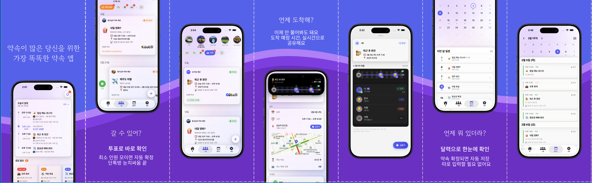

# Promiso

> 약속이 많은 당신을 위한 가장 똑똑한 약속 앱

<p align="center">
  
</p>

<p align="center">
  
  
  
  
</p>

## 🛠️ Tech Stack

### Frontend
- **Language**: Swift 6.2+
- **UI Framework**: SwiftUI
- **Architecture**: The Composable Architecture (TCA) 1.22.2
- **iOS Version**: 18.0+
- **Build System**: Tuist 4.65.7
- **Design**: iOS 26 Glass Effect + Aurora Background

### Backend
- **Platform**: Firebase
- **Services**:
  - Authentication (Apple, Google)
  - Cloud Firestore (Database)
  - Cloud Functions (TypeScript)
  - Cloud Storage
  - Cloud Messaging (Push Notifications)

### DevOps
- **CI/CD**: GitHub Actions
- **Deployment**: Fastlane
- **Distribution**: TestFlight (Stage/Prod)

## 🚀 Quick Start

### 1. 필수 도구 설치

```bash
# Xcode 26.0+ (App Store)
# Homebrew, mise, Tuist
brew install mise
curl -Ls https://install.tuist.io | bash
```

### 2. 프로젝트 Clone 및 초기 설정

```bash
git clone https://github.com/kswift1/Promiso.git
cd Promiso
make setup  # mise 신뢰 + 의존성 설치 + 프로젝트 생성
```

### 3. 환경 설정 (Secret Config)

```bash
# 방법 1: Notion 동기화 (팀원)
export NOTION_API_KEY="ntn_xxxxx"
make secrets-pull

# 방법 2: 로컬 생성 (개인)
cp .env.template .env  # API Key 입력
./scripts/generate-xcconfig.sh
```

> 📘 **상세 가이드**: [Config/README.md](Config/README.md)

### 4. Xcode에서 실행

```bash
# Xcode 열기
open Promiso.xcworkspace

# 또는 Xcode에서 직접 Promiso.xcworkspace 열기
```

**타겟 선택**:
- `PromisoDev` - 로컬 개발 (기본)
- `PromisoStage` - QA/스테이징
- `Promiso` - 프로덕션

## 📁 프로젝트 구조 & 아키텍처

```
Projects/
├── App/              메인 앱 (진입점)
├── Features/         TCA Feature 모듈 (비즈니스 로직)
├── Clients/          TCA Dependencies (데이터 레이어)
└── Shared/           공통 컴포넌트, 모델
```

**의존성 방향**: `App → Features → Clients → Shared`

> 📘 **상세 가이드**: [docs/ARCHITECTURE.md](docs/ARCHITECTURE.md)
> - 계층 구조 및 모듈 설명
> - TCA 패턴 및 베스트 프랙티스
> - 데이터 흐름 및 Feature 예시

## 🛠️ 개발

```bash
# Feature 관리
make feature FEATURE_NAME=Notification           # Feature 생성
make remove-feature FEATURE_NAME=Notification    # Feature 삭제

# 리소스
make color                     # 컬러 에셋 재생성

# Firebase
make emulator-start            # Firebase 에뮬레이터 실행
make functions-build           # Functions 빌드
make functions-api-preview     # OpenAPI 미리보기

# Secrets 관리
make secrets-pull              # Notion → xcconfig 동기화
make secrets-list              # 시크릿 목록 보기
make secrets-add               # 새 시크릿 추가

# 도움말
make help                      # 전체 명령어 보기
```

> 📘 **개발 가이드**: [docs/DEVELOPMENT.md](docs/DEVELOPMENT.md)

## 📚 문서

> 📘 **문서 인덱스(권장 시작점)**: [docs/README.md](docs/README.md)

| 카테고리 | 문서 |
|---------|------|
| **시작하기** | [초기 설정](docs/SETUP_GUIDE.md) · [환경 구성](docs/ENVIRONMENT.md) · [아키텍처](docs/ARCHITECTURE.md) |
| **개발** | [개발 가이드](docs/DEVELOPMENT.md) · [Secret Config](Config/README.md) |
| **AI 도구** | [Claude Code](.claude/CLAUDE.md) - `/new-feature`, `/review-pr` 등 |

## 🚢 배포 & 브랜치 전략

### 브랜치 전략

```
main (프로덕션)
  ↑
release/v* (릴리즈)
  ↑
feature/* (기능 개발)
```

**워크플로우**:
1. `feature/*` 브랜치에서 개발
2. `release/v*` 브랜치로 PR
3. 리뷰 & 머지 후 `release/v*` → `main`
4. `main`에 Tag 추가 시 자동 배포

### CI/CD (GitHub Actions)

| 이벤트 | 동작 |
|--------|------|
| **PR → release/** | 빌드 & 테스트 실행 |
| **PR → main** | 빌드 & 테스트 실행 |
| **Tag push (v\*)** | TestFlight 자동 배포 |

### 배포 환경

- **Dev**: 로컬 개발 (Firebase Emulator)
- **Stage**: QA/테스트 (`PromisoStage`)
- **Prod**: 프로덕션 (`Promiso`)

> 📘 **상세 가이드**: [브랜치 전략](docs/BRANCH_STRATEGY.md) · [CI/CD](docs/CI_CD.md) · [배포](docs/DEPLOYMENT.md)
